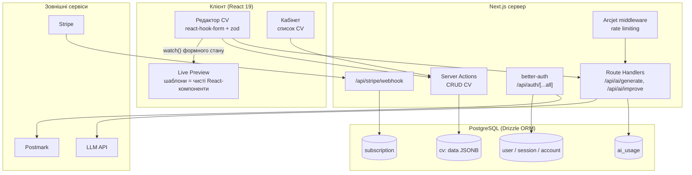

# CV Builder — задум проєкту

> Дипломний проєкт у форматі стартапу. Документ описує бачення продукту, план дослідження ринку, підхід до аналізу процесу розробки та реалістичну оцінку складності системи, яку можливо побудувати у відведений час.

---

## 1. Задум проєкту

### 1.1. Проблема

Пошук роботи починається з резюме, і саме тут кандидати витрачають непропорційно багато часу:

- класичні редактори (Word, Google Docs) погано тримають верстку — одна зайва стрічка ламає весь макет;
- існуючі конструктори часто ховають базовий функціонал (експорт у PDF, другий шаблон) за платною підпискою з першої ж хвилини;
- кандидатам важко сформулювати описи досвіду: текст виходить або сухим переліком обов'язків, або water-текстом, який рекрутери не читають;
- резюме треба адаптувати під кожну вакансію, а робити це вручну довго.

### 1.2. Рішення

**CV Builder** — вебзастосунок, який перетворює створення резюме з "боротьби з версткою" на заповнення структурованої форми з миттєвим результатом:

1. **Форма + live preview.** Користувач заповнює секції (контакти, досвід, освіта, навички, проєкти), а праворуч у реальному часі бачить готове резюме в обраному шаблоні. Перемикання шаблону — один клік, дані не втрачаються.
2. **Збереження та повторне використання.** Кожне резюме зберігається в акаунті; можна мати кілька версій (наприклад, під різні ролі), дублювати їх та повертатися до редагування будь-коли.
3. **AI-генерація чернетки.** Користувач вводить простий запит ("Frontend developer, 3 роки досвіду, React") — система генерує заповнений каркас CV, який далі редагується вручну. Це прибирає проблему "чистого аркуша".
4. **AI-покращення тексту.** Окрема дія над будь-яким текстовим полем: переписати опис досвіду professionally, зробити його лаконічнішим, додати дієслова дії, підлаштувати під роль. Користувач бачить "було/стало" і сам вирішує, чи приймати правку.
5. **Авторизація та кабінет.** Список усіх CV прив'язаний до акаунта (email + пароль, passkey, OAuth). Без акаунта можна спробувати редактор, але збереження вимагає реєстрації — це і є перша конверсійна точка.
6. **Монетизація (freemium).** Безкоштовно: 1–2 збережених CV, базові шаблони, обмежена кількість AI-запитів. За підпискою: усі шаблони, необмежені CV, більший ліміт AI-операцій, експорт без водяного знака.

### 1.3. Цільова аудиторія

- **Первинна:** студенти та junior/middle ІТ-спеціалісти, які активно шукають роботу і подаються на багато вакансій — їм потрібні кілька версій CV та швидка адаптація текстів.
- **Вторинна:** люди, що змінюють кар'єру або рідко оновлюють резюме, — їм найцінніша AI-генерація чернетки, бо вони не знають, "як прийнято писати".

### 1.4. Ціннісна пропозиція (у порівнянні з конкурентами)

- чесний freemium: базовий сценарій "заповнив → завантажив PDF" доступний без оплати;
- AI не як маркетингова галочка, а як вбудований у процес інструмент (чернетка + точкове покращення полів);
- швидкість: від реєстрації до готового PDF — менш ніж 10 хвилин.

---

## 2. Дослідження ринку

### 2.1. Аналіз конкурентів (кабінетне дослідження)

План: скласти порівняльну таблицю по 5–7 гравцях — **Canva Resume, Zety, Novoresume, Resume.io, FlowCV, Rezi, Kickresume** — за критеріями:

| Критерій | Що з'ясовую |
|---|---|
| Модель монетизації | що безкоштовно, де paywall, ціна підписки |
| AI-функції | генерація, покращення тексту, підбір під вакансію |
| UX редактора | live preview, кількість кроків до PDF |
| Шаблони | кількість, ATS-сумісність |
| Слабкі місця | скарги користувачів у відгуках (Trustpilot, Reddit) |

Мета — знайти прогалину: гіпотеза полягає в тому, що більшість конкурентів або агресивно монетизуються (Zety, Resume.io), або мають слабкий AI (FlowCV). Ніша "чесний freemium + практичний AI" виглядає вільною для студентського/junior-сегмента.

### 2.2. Дослідження користувачів

- **Опитування (Google Forms)** серед студентів та учасників ІТ-спільнот: скільки часу займає створення CV, якими інструментами користуються, що дратує, чи готові платити та за що саме. Цільова вибірка — 50+ відповідей.
- **5–8 глибинних інтерв'ю** з людьми, що зараз шукають роботу: пройти з ними їхній реальний процес створення резюме та зафіксувати больові точки.
- **Юзабіліті-тести прототипу** (після MVP): 5 користувачів виконують сценарій "створи CV під конкретну вакансію" — вимірюю час до готового PDF та точки, де люди застрягають.

### 2.3. Погляд з боку "покупця" резюме

Коротке опитування/інтерв'ю 3–5 рекрутерів або HR: що вони реально читають у CV, які резюме відсіюють, наскільки важлива ATS-сумісність. Це напряму впливає на дизайн шаблонів і на промпти для AI-покращення тексту.

### 2.4. Оцінка ринку

Верхньорівнева оцінка TAM/SAM/SOM на основі відкритих даних (кількість шукачів роботи в ІТ-сегменті України/ЄС, трафік конкурентів через Similarweb) — для розділу диплому про комерційну доцільність, без претензії на інвестиційну точність.

---

## 3. Аналіз процесу: як досягається чіткість рішення

### 3.1. Від задачі до вимог

Процес ітеративний, кожен крок звужує невизначеність:

1. **Формалізація функціоналу → user stories.** Кожен пункт задуму розкладається на історії виду "Як користувач, я хочу перемкнути шаблон і не втратити дані, щоб порівняти вигляд CV". Історії пріоритезуються за трьома рівнями: **P0 — критичний шлях** (без цього продукт не існує: редактор, збереження, PDF), **P1 — цінність продукту** (AI-функції, кілька шаблонів), **P2 — бажане** (монетизація, додаткові шаблони). Робота йде строго згори вниз: P2 не починається, поки не закритий P0.
2. **Моделювання даних раніше за UI.** Центральна сутність — документ CV: структура (секції, записи досвіду, навички) визначає і форму редактора, і контракт для шаблонів, і формат, який передається AI — тому схема даних проєктується та фіксується першою (zod-схема як єдине джерело правди, від неї — типи TypeScript і колонки БД).
3. **Прототипування ризикованих місць.** Найризикованіші гіпотези перевіряються окремим прототипом до включення в план: (а) якісний PDF-експорт із HTML-шаблону, (б) стабільна структурована відповідь від LLM для генерації CV. Якщо підхід не працює — змінюється рішення, а не терміни.
4. **Вертикальні зрізи замість горизонтальних шарів.** Кожна ітерація дає працюючий наскрізний сценарій (форма → preview → збереження → PDF), а не "спочатку весь бекенд, потім весь фронтенд". Це дозволяє рано тестувати на користувачах і в будь-який момент мати завершений продукт меншого обсягу.

### 3.2. Критерії чіткості рішення

Рішення вважається "чітким", коли для кожної функції зафіксовано:

- **сценарій використання** (user story + acceptance criteria);
- **модель даних** (яка частина схеми задіяна);
- **межі** (що свідомо *не* робиться в цій версії — наприклад, у MVP немає drag-and-drop секцій);
- **метрика перевірки** (як зрозуміти, що функція працює добре: час до PDF, частка прийнятих AI-правок тощо).

### 3.3. Інструменти процесу

- **Kanban-дошка** (GitHub Projects) з backlog'ом історій та мітками P0/P1/P2;
- **Storybook** — ізольована розробка та документація UI-компонентів редактора і шаблонів;
- **Vitest + Playwright** — юніт-тести логіки та e2e-тести ключових сценаріїв;
- **Biome** — єдиний стиль коду;
- тижневі ітерації з демо самому собі / науковому керівнику як checkpoint.

---

## 4. System design та оцінка складності

Термін — до початку вересня, тобто **~7 робочих тижнів**. Це жорстке обмеження, тому дизайн системи описаний конкретно: з модулів, потоків даних і чесної оцінки складності кожного блоку, з урахуванням того, що частина системи вже реалізована.

### 4.1. Архітектура системи

Монолітний fullstack-застосунок на Next.js 16 (App Router): клієнт, серверна логіка та інтеграції живуть в одному деплої. Для дипломного обсягу це свідоме рішення — жодних мікросервісів, черг чи окремого API-сервера, які з'їли б увесь бюджет часу на інфраструктуру.

Ключові дизайн-рішення:

1. **Одна zod-схема CV як контракт усієї системи.** Тип `CvData` (вже існує в `src/app/cv-builder/template/`) використовується чотири рази: як схема форми редактора, як props шаблонів preview, як JSONB-колонка в БД і як structured-output схема для LLM. Зміна структури CV — це зміна в одному місці.
2. **CV зберігається як JSONB-документ, а не нормалізовані таблиці.** CV завжди читається і пишеться цілком, реляційні запити по окремих секціях не потрібні; JSONB прибирає 5–6 таблиць і всі join'и. Таблиця `cv` мінімальна: `id, user_id (FK), title, template_id, data (jsonb), created_at, updated_at`.
3. **Live preview без сервера.** Preview підписаний на стан форми через `watch()` — жодних запитів, затримка рендеру нульова. Шаблон — чиста функція `CvData → JSX`, тому додавання нового шаблону не торкається решти системи.
4. **PDF через print-CSS, а не headless-браузер.** Експорт уже працює через `window.print()` з друкованими стилями шаблону. Server-side рендер у Chromium — запасний варіант, який свідомо не будується, поки print-CSS дає прийнятну якість: це економить ~тиждень.
5. **AI — два вузькі ендпоїнти, а не "чат".** `/api/ai/generate` приймає `{role, experience, stack}` і повертає валідований `CvData`; `/api/ai/improve` приймає `{fieldPath, text, tone}` і повертає варіант тексту. Обидва — за Arcjet rate limit і перевіркою ліміту в `ai_usage`. Вузький контракт = передбачувана вартість і простіше тестування.
6. **Монетизація через better-auth Stripe-плагін.** Стан підписки — це поле, яке читають три перевірки (ліміт CV, ліміт AI-запитів, доступ до преміум-шаблонів); власної білінгової логіки немає.

### 4.2. Поточний стан і складність модулів

| Модуль | Стан | Складність | Що лишилося |
|---|---|---|---|
| Редактор (форма секцій) | ✅ реалізовано | — | косметика |
| Live preview + 2 шаблони | ✅ реалізовано | — | 1 преміум-шаблон |
| Авторизація (better-auth + passkey + email) | ✅ реалізовано | — | — |
| PDF-експорт (print-CSS) | ✅ базово працює | низька | контроль розривів сторінок |
| Персистентність CV (таблиця `cv`, CRUD, кабінет) | ❌ | **середня** | схема, server actions, сторінка списку, дублювання |
| AI-генерація чернетки | ❌ | **висока** | ендпоїнт, промпт, structured output, retry, UX підстановки |
| AI-покращення тексту | ❌ | середня | ендпоїнт, diff "було/стало" в UI |
| Ліміти та захист AI | ❌ | низька | Arcjet-правило + таблиця `ai_usage` |
| Монетизація (Stripe + feature-gating) | ❌ | середня | тариф, checkout, 3 перевірки доступу |
| Тести + деплой | частково | середня | e2e критичного шляху, продакшн-деплой |

Найскладніший модуль — AI-генерація: якість промпта і стабільність структурованої відповіді неможливо оцінити наперед, тому саме він прототипується першим серед нової роботи і має найбільший запас часу.

### 4.3. План на 7 тижнів

| Тиждень | Обсяг | Пріоритет |
|---|---|---|
| **1** | Схема `cv` + міграція; server actions CRUD; автозбереження з редактора | P0 |
| **2** | Кабінет: список CV, створення/дублювання/видалення; guard неавторизованих | P0 |
| **3** | Прототип AI-генерації: промпт + structured output + валідація zod; рішення go/no-go по моделі | P1 |
| **4** | AI-генерація в продукті (форма запиту → чернетка в редакторі); AI-покращення поля з "було/стало" | P1 |
| **5** | Ліміти AI (Arcjet + `ai_usage`); Stripe-тариф і feature-gating; преміум-шаблон | P2 |
| **6** | Стабілізація: e2e-тести критичного шляху, розриви сторінок у PDF, доступність, деплой | P0 |
| **7** | Буфер: юзабіліті-тести на 5 користувачах, виправлення, матеріали для диплому | — |

Логіка плану: **після тижня 2 продукт уже цілісний** (редактор → збереження → PDF), тож навіть за повного провалу AI-етапу диплом має завершену систему. Тижні 3–5 нарощують цінність, тиждень 7 — буфер, який поглинає неминучі зсуви.

### 4.4. Що свідомо не входить у дипломну версію

- ❌ шеринг CV за публічним посиланням;
- ❌ парсинг існуючих PDF-резюме в структуру;
- ❌ ATS-скоринг відповідності CV вакансії;
- ❌ server-side PDF-рендер (тільки якщо print-CSS виявиться недостатнім);
- ❌ мобільний застосунок — тільки адаптивний веб;
- ❌ багатомовність інтерфейсу (контент CV — будь-якою мовою, UI — однією).

### 4.5. Головні ризики та запасні плани

| Ризик | План Б |
|---|---|
| LLM повертає невалідну структуру | Structured output + zod-валідація, retry з уточненим промптом; у крайньому разі — генерація по одній секції за запит |
| Print-CSS ламає верстку на межах сторінок | `break-inside: avoid` на картках секцій; якщо не рятує — Playwright уже в devDependencies для server-side рендеру |
| Вартість AI-запитів | Жорсткі ліміти через Arcjet + `ai_usage`; дешевша модель для покращення тексту |
| Не вистачає часу на Stripe | Feature-gating лишається, оплата — в тестовому режимі Stripe як proof of concept |
| Зсув будь-якого етапу | Тиждень 7 — буфер; пріоритети P0→P2 гарантують, що жертвується преміум-функціонал, а не ядро |

### 4.6. Висновок щодо складності

Приблизно 40% системи (редактор, preview, шаблони, авторизація, базовий PDF) уже реалізовано — 7 тижнів витрачаються на предметну логіку, що лишилася: персистентність, дві AI-функції та монетизацію. Дизайн побудований так, що складність контрольована: одна схема даних як контракт, JSONB замість нормалізації, два вузькі AI-ендпоїнти замість відкритого чату, готові плагіни для auth і Stripe. Результат — **завершений вертикальний продукт** (редактор → акаунт → AI → PDF → підписка), досяжний у 7 тижнів з буфером, а не набір недороблених функцій.
